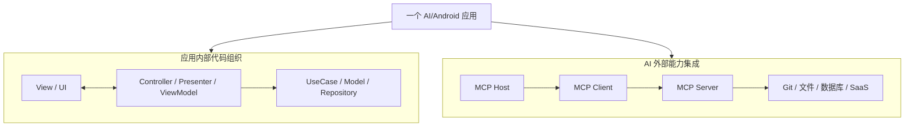
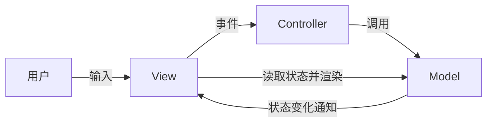
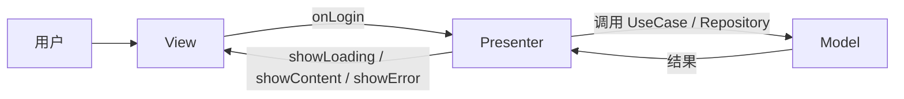
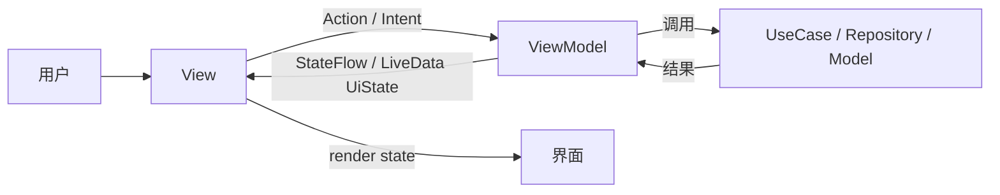
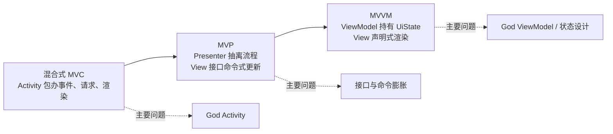
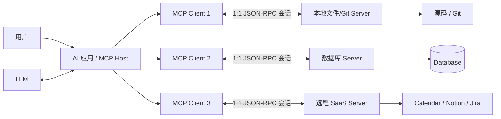
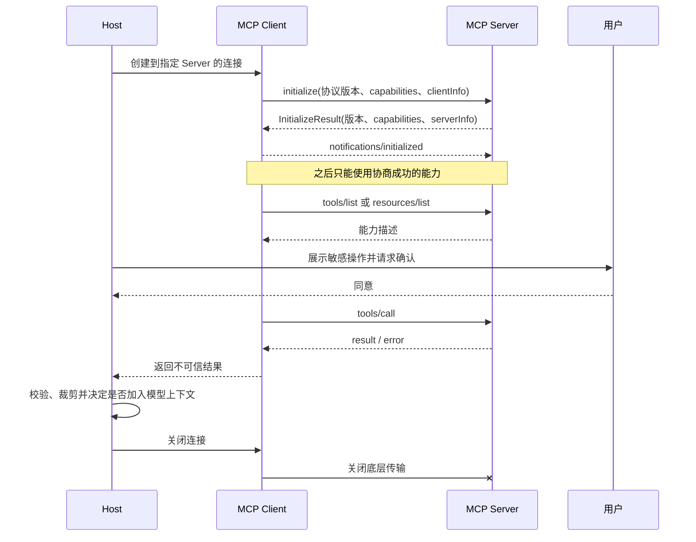
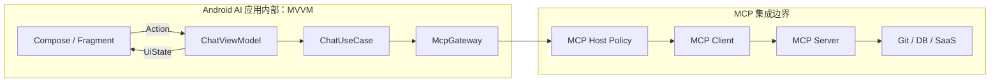
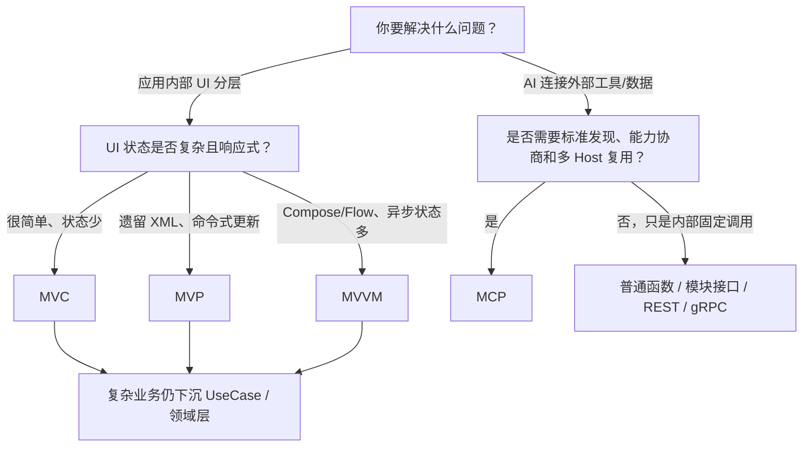

# MVC、MVP、MVVM 与 MCP 架构讲解

## 阅读约定

本文中的 MCP 指 **Model Context Protocol**，当前依据正式规范版本 `2025-11-25`。

需要先纠正一个分类错误：

- MVC、MVP、MVVM：解决应用内部 UI、交互和业务逻辑如何分工。
- MCP：解决 AI Host 如何用标准协议连接外部数据、工具和工作流。

它们不在同一个抽象层，也不存在“MVC -> MVP -> MVVM -> MCP”的升级关系。



一句话定位：

> MVC/MVP/MVVM 决定应用内部代码如何分工；MCP 决定 AI 应用如何连接外部能力。

---

## 问题分析

学习架构模式最常见的错误是背定义：

```text
MVC = Model + View + Controller
MVP = Model + View + Presenter
MVVM = Model + View + ViewModel
```

这没有回答真正影响代码质量的问题：

1. 用户事件最终由谁解释？
2. UI 状态由谁持有？
3. View 如何获得新状态？
4. 中间层是否依赖具体 View？
5. 业务规则能否脱离 Activity/Fragment 测试？
6. 生命周期结束后，谁负责解除引用或恢复状态？

本文始终用这些维度比较，而不是根据类名贴标签。

---

## 统一对比

| 维度 | MVC | MVP | MVVM |
|------|-----|-----|------|
| 交互入口 | Controller | Presenter | ViewModel |
| View 是否接触 Model | 经典 MVC 通常可以 | 通常不可以 | 通常只订阅 UiState，不直接操作领域 Model |
| 中间层是否持有 View | Controller 常知道具体 View | Presenter 持有 View 接口 | ViewModel 不应持有 View |
| UI 更新方式 | View 观察/读取 Model，或 Controller 协调 | Presenter 命令式调用 View | View 订阅状态并渲染 |
| UI 状态主要位置 | Model，临时状态可能在 Controller | Presenter 或 Model | ViewModel 的 UiState |
| 测试重点 | Model 与独立 Controller | Presenter 调用了哪些 View 方法 | 输入 Action 后产生的状态序列 |
| 生命周期成本 | 依赖具体框架实现 | 需要 attach/detach | AndroidX ViewModel + 生命周期感知订阅 |
| 样板代码 | 少 | 多 | 中等 |
| 常见膨胀点 | God Controller/Activity | God Presenter、View 接口爆炸 | God ViewModel、事件与状态混乱 |

---

## 一、MVC

### 1. 角色职责

- **Model**：领域状态、业务规则、用例和数据能力，不只是 Bean 或数据库。
- **View**：展示 Model 状态并收集用户输入。
- **Controller**：解释用户输入，选择并调用 Model 操作。

经典 GUI MVC 的数据流：



### 2. 一次操作如何流动

```text
用户点击“登录”
 -> View 将事件交给 Controller
 -> Controller 调用 Model.login()
 -> Model 执行业务规则并更新状态
 -> Model 通知状态变化
 -> View 读取新状态并重绘
```

### 3. 最小示例

```kotlin
class CounterModel {
    private val listeners = mutableListOf<(Int) -> Unit>()
    var count: Int = 0
        private set

    fun increment() {
        count++
        listeners.forEach { it(count) }
    }

    fun observe(listener: (Int) -> Unit) {
        listeners += listener
        listener(count)
    }
}

class CounterController(private val model: CounterModel) {
    fun onIncrementClicked() = model.increment()
}

// View 只绑定输入与渲染。
model.observe { countText.text = it.toString() }
button.setOnClickListener { controller.onIncrementClicked() }
```

### 4. 优点

- 角色直观，初期代码少。
- Model 可以独立于 UI。
- 简单操作的调用链短。

### 5. 缺点

- 经典 MVC 允许 View 读取 Model，界面可能绑定过多领域细节。
- Android 中常把 Activity 同时写成 View、Controller 和生命周期宿主。
- 异步、加载、失败、重试、分页增加后，Controller 容易膨胀。

### 6. 适用场景

- 小型设置页、静态详情页。
- 简单内部工具、短期原型。
- 输入到结果非常直接、异步状态少。

### 7. 不适用场景

- 多数据源并发、复杂表单、离线同步。
- 大量状态需要跨配置变更恢复。
- 核心页面要求高覆盖率 JVM 单元测试，但 Controller 强依赖 Android。

### 8. 注意变体

Smalltalk MVC、Web MVC 和 Android 社区常说的 MVC 并不是完全相同的结构。MVC 是一族模式，不要把其中一种数据流当成唯一标准。

---

## 二、MVP

### 1. 角色职责

- **Model**：领域规则、用例和数据访问。
- **View**：被动界面，暴露 `showLoading()`、`showError()` 等接口。
- **Presenter**：接收事件、调用 Model、加工显示数据并命令 View 更新。



### 2. 一次操作如何流动

```text
View 调用 presenter.onLogin(account, password)
 -> Presenter 校验输入并调用 LoginUseCase
 -> Model 返回成功或失败
 -> Presenter 转换为界面可直接展示的内容
 -> Presenter 调用 View.showSuccess() 或 showError()
```

### 3. 最小示例

```kotlin
interface LoginView {
    fun showLoading()
    fun showContent(userName: String)
    fun showError(message: String)
}

class LoginPresenter(
    private val loginUseCase: LoginUseCase
) {
    private var view: LoginView? = null

    fun attach(view: LoginView) {
        this.view = view
    }

    fun detach() {
        view = null
    }

    suspend fun onLogin(account: String, password: String) {
        view?.showLoading()
        loginUseCase(account, password)
            .onSuccess { view?.showContent(it.name) }
            .onFailure { view?.showError(it.message ?: "登录失败") }
    }
}
```

### 4. 优点

- View 不直接操作 Model，边界比常见 Android MVC 清楚。
- Presenter 可写成普通 Java/Kotlin 对象，容易进行 JVM 单元测试。
- 适合把庞大 Activity 中的决策逻辑逐步抽离。

### 5. 缺点

- 每个页面可能需要 Contract、View 接口、Presenter 和大量转发方法。
- Presenter 持有 View，忘记 detach 会泄漏 Activity/Fragment。
- `showA()/hideA()/enableB()` 的命令顺序可能构造出非法 UI 状态。
- 测试常退化为验证 View 方法调用，对内部重构敏感。

### 6. 适用场景

- 传统 XML View、命令式控件更新。
- 团队尚未采用 Flow、LiveData、Compose。
- 需要低风险重构遗留 God Activity。
- View 与 Presenter 基本一对一。

### 7. 不适用场景

- Jetpack Compose 等声明式 UI。
- 多个 View 同时消费同一状态。
- 页面状态组合复杂，命令式更新容易不同步。

---

## 三、MVVM

### 1. 角色职责

- **Model**：领域实体、UseCase、Repository 和数据源。
- **View**：发送用户 Action，订阅状态并负责渲染。
- **ViewModel**：处理 Action、调用领域层、维护展示状态，不持有具体 View。



### 2. 一次操作如何流动

```text
View 调用 viewModel.login()
 -> ViewModel 发布 Loading UiState
 -> ViewModel 调用 LoginUseCase
 -> UseCase 返回成功或失败
 -> ViewModel 生成新的 UiState
 -> View 订阅状态并整体渲染
```

### 3. 最小示例

```kotlin
data class LoginUiState(
    val loading: Boolean = false,
    val userName: String? = null,
    val error: String? = null
)

class LoginViewModel(
    private val loginUseCase: LoginUseCase
) : ViewModel() {
    private val _state = MutableStateFlow(LoginUiState())
    val state: StateFlow<LoginUiState> = _state.asStateFlow()

    fun login(account: String, password: String) = viewModelScope.launch {
        _state.value = LoginUiState(loading = true)
        _state.value = loginUseCase(account, password).fold(
            onSuccess = { LoginUiState(userName = it.name) },
            onFailure = { LoginUiState(error = it.message ?: "登录失败") }
        )
    }
}

@Composable
fun LoginScreen(viewModel: LoginViewModel) {
    val state by viewModel.state.collectAsStateWithLifecycle()
    LoginContent(state = state, onLogin = viewModel::login)
}
```

### 4. 优点

- ViewModel 不持有 View，生命周期耦合更低。
- 状态驱动 UI，适合异步数据、复杂表单和 Compose。
- 测试可断言 Action 后的状态序列，而不是多个 View 方法调用。
- AndroidX ViewModel 可以跨配置变更保存内存状态。

### 5. 缺点

- 网络、数据库、导航和业务规则全塞入 ViewModel 会形成 God ViewModel。
- 一次性事件处理不当会在旋转后重复弹窗或丢事件。
- AndroidX ViewModel 不会自动跨进程死亡恢复状态。
- 极简单页面引入完整 UiState/Action 体系可能得不偿失。

### 6. 适用场景

- Compose 或数据驱动 XML 页面。
- 搜索、分页、复杂表单、加载/错误/空态并存。
- 多个界面消费同一状态。
- 希望测试输入到状态转换的团队。

### 7. 不适用场景

- 完全静态或只有一个直接动作的页面。
- 团队只是把所有逻辑迁入 ViewModel，却没有 UseCase/领域边界。

### 8. 状态恢复边界

AndroidX ViewModel 只能帮助跨旋转等配置变更保留内存状态。进程死亡后，关键数据仍需要：

- `SavedStateHandle`
- 本地持久化
- 从 Repository 重新加载
- 服务端恢复

---

## 四、三种 UI 模式如何演进

以同一个登录页面为例：



演进的关键不是把类改名，而是逐步做到：

1. 从 Activity/Fragment 抽出业务规则。
2. 从命令式 View 调用转为显式 UI 状态。
3. 让 View 依赖状态，让状态持有者不依赖具体 View。
4. 复杂业务继续下沉到 UseCase/领域层，而不是扩大中间层。

---

## 五、Android 组件如何映射

| Android 元素 | 更准确的职责 |
|--------------|--------------|
| Activity/Fragment | 生命周期和导航宿主，也可能承担部分 View 职责 |
| XML/View/Compose | 实际渲染界面 |
| AndroidX ViewModel | 生命周期感知状态持有者，不代表自动采用 MVVM |
| Repository | 协调数据来源，是 Model 层的一部分 |
| UseCase | 封装业务动作或规则，是领域/Model 层 |
| Room/Retrofit | 数据源实现，不是完整 Model |
| `data class` | 数据结构，不自动等于 Model |

错误判断：

```text
Activity = Controller
XML = View
JavaBean = Model
```

这只能描述文件外观。若 Activity 同时负责渲染、校验、网络、转换和状态保存，它实际上混合了全部角色。

---

## 六、MCP：Model Context Protocol

### 6.1 MCP 解决什么问题

没有 MCP 时，每个 AI 应用都要为文件、Git、数据库、日历、知识库分别编写专用集成。

MCP 提供统一的：

- 能力发现
- 协议版本和能力协商
- 工具、资源、提示模板描述
- 请求/结果传输
- 用户同意和授权边界
- 本地/远程 Server 接入方式

它类似 AI 工具生态的标准连接层，而不是页面架构模式。

### 6.2 总体架构



### 6.3 三个核心角色

**Host**

- AI/LLM 应用的总协调者。
- 创建和管理多个 MCP Client。
- 决定连接、权限、用户同意和上下文披露。
- 聚合多个 Server 的结果。
- Server 原则上不能直接看到完整聊天或其他 Server 上下文。

**Client**

- 运行在 Host 内。
- 每个 Client 与一个特定 Server 保持 1:1 有状态会话。
- 负责版本/能力协商、请求、通知和结果传递。

**Server**

- 聚焦一个能力域。
- 可以是本地子进程，也可以是远程 HTTP 服务。
- 暴露 Resources、Prompts、Tools。
- 可以请求 Host 提供 Sampling、Roots、Elicitation 等能力。

### 6.4 生命周期



三个阶段：

1. **Initialization**：协商版本、双方能力和实现信息。
2. **Operation**：只调用已协商能力，处理请求、结果、通知、取消和进度。
3. **Shutdown**：没有 MCP 专用 shutdown RPC，通过 stdio/HTTP 底层传输关闭。

### 6.5 核心原语与控制权

| 能力 | 提供方 | 主要控制者 | 例子 |
|------|--------|------------|------|
| Prompts | Server | 用户 | “生成代码审查报告”模板、斜杠命令 |
| Resources | Server | 应用/Host | 文件、Git 历史、数据库记录 |
| Tools | Server | 模型选择，Host/用户授权 | 搜索代码、写文件、创建工单 |
| Sampling | Client | Host/用户 | Server 请求 Host 调用 LLM |
| Roots | Client | Host | 允许 Server 操作的 URI/文件边界 |
| Elicitation | Client | 用户 | Server 请求补充账号、选项或确认 |

此外还有 Logging、Completion、Progress、Cancellation、Pagination、Tasks 等协议能力。

“Tools 由模型控制”不等于模型拥有最终权限。模型可以建议调用，Host 和用户仍必须执行安全策略与确认。

### 6.6 标准传输

**stdio**

- Host/Client 启动本地 Server 子进程。
- stdin/stdout 传递逐行 UTF-8 JSON-RPC。
- stdout 不能混入普通日志，日志应写 stderr。
- 启动一个 stdio Server 等价于以 Host 权限运行本地代码。

**Streamable HTTP**

- 使用单一 MCP endpoint，通过 HTTP POST/GET 通信。
- 响应可以是 JSON，也可以使用 SSE 流。
- SSE 是 Streamable HTTP 的可选流机制，不是第三种独立传输。

旧 `HTTP+SSE` 属于 `2024-11-05` 的废弃传输，只应用于旧实现兼容。

### 6.7 一次工具调用

```json
{
  "jsonrpc": "2.0",
  "id": 7,
  "method": "tools/call",
  "params": {
    "name": "search_code",
    "arguments": {
      "query": "WindowManagerService"
    }
  }
}
```

Server 返回的内容必须视为不可信输入。Host 需要：

- 校验结果结构和大小。
- 防止工具结果中的提示注入影响其他操作。
- 决定哪些内容可以进入模型上下文。
- 避免把一个 Server 的敏感结果自动发送给另一个 Server。

### 6.8 安全边界

**用户与数据**

- 暴露用户数据前取得明确同意。
- 敏感工具调用展示工具名、输入和影响。
- Sampling 的 prompt 和生成结果保持可审阅、可控制。
- 只向 Server 披露完成任务所需的最小上下文。

**远程 HTTP**

- OAuth token 必须绑定目标 MCP Server audience。
- Server 禁止把 Client token 透传给下游 API。
- 校验 `Origin`，本地 HTTP Server 优先绑定 `127.0.0.1`。
- Session ID 不能代替身份认证。
- 防御 SSRF、恶意重定向、提示注入和不可信工具描述/结果。

**本地 stdio**

- 启动前展示完整命令并取得确认。
- 使用沙箱、最小文件权限和最小网络权限。
- 不把长期密钥硬编码在命令或仓库中。
- 不因为 Server 来自包管理器就默认可信。

### 6.9 MCP 适用场景

- 编程助手连接源码、Git、构建和测试工具。
- 企业助手统一查询数据库与知识库。
- 个人助手连接 Calendar、Notion、邮件等 SaaS。
- 设计 Agent 连接 Figma、Blender 或内容生产工作流。
- 同一外部能力需要被多个 AI Host 标准化复用。

### 6.10 MCP 不适用场景

- 替代 MVC/MVP/MVVM 管理页面状态。
- 单应用内部固定函数调用，普通接口已经足够。
- 没有 LLM Host、能力发现或上下文交换需求的普通 REST 服务。
- 硬实时、极低延迟的数据面。
- 没有确认、沙箱和最小权限，却要运行不可信本地命令。

---

## 七、MVVM 与 MCP 可以同时使用

一个 Android AI 应用可以内部使用 MVVM，外部使用 MCP：



职责边界：

- ViewModel 维护聊天页面的 loading、messages、error、confirmation 等 UiState。
- UseCase 决定业务流程，例如“搜索代码后总结”。
- McpGateway 隔离 MCP SDK/JSON-RPC 细节。
- MCP Host 决定 Server 连接、工具权限、用户确认和上下文披露。
- MCP Server 只负责具体外部能力，不管理 Android 页面状态。

这说明它们是可组合关系，而不是竞争关系。

---

## 八、如何选型



### 场景速查

| 场景 | 推荐 | 原因 |
|------|------|------|
| 只有开关和保存按钮的设置页 | MVC 或简单分层 | 状态少，完整 MVVM 成本可能过高 |
| 遗留 Activity 3000 行，需要逐步拆分 | MVP 过渡 | 可先抽出流程并保持原命令式 View |
| Compose 搜索、分页、错误/空态/重试 | MVVM | UiState 和状态流更自然 |
| 多页面共享用户/播放状态 | MVVM + Repository | 多 View 订阅同一状态 |
| AI IDE 连接 Git、文件和测试工具 | MCP | 需要标准能力发现、工具调用和权限边界 |
| 普通 App 调自己后端固定接口 | REST/gRPC/Repository | 没有 MCP 动态能力和 LLM Host 需求 |
| Android AI 助手连接多个工具 | MVVM + MCP | MVVM 管 UI，MCP 管外部工具集成 |

---

## 九、常见误区

### “Activity 天生就是 Controller”

错误。架构角色由职责和依赖决定。Activity 同时做渲染、网络、业务规则和状态保存时，它是混合层，不是合格 Controller。

### “用了 AndroidX ViewModel 就是 MVVM”

错误。还要检查 View 是否状态驱动、ViewModel 是否依赖具体 View、业务是否下沉。

### “MVVM 必须使用 Data Binding”

错误。Compose、StateFlow、LiveData 或手工 render 都能实现状态驱动。

### “MVP 有接口，所以一定可测试”

错误。若 Presenter/Activity 仍直接依赖 Android、网络或数据库静态 API，接口没有解决根因。

### “Model 就是数据库或 Bean”

错误。Model 表达领域状态、规则、用例和数据能力。

### “ViewModel 能恢复所有状态”

错误。进程死亡需要 SavedStateHandle、持久化或重新加载。

### “MCP 是 MVVM 的下一代架构”

错误。MCP 是 AI 外部能力协议，和 View/Controller/ViewModel 的职责划分不在同一层。

### “MCP Server 暴露 Tool 后模型就能直接执行”

错误。Host 仍需权限策略，敏感操作还需要用户确认。

---

## 十、实践建议

### 练习 1：同一个登录页实现 MVP 和 MVVM

MVP 测试：

```text
输入账号密码
 -> verify(view).showLoading()
 -> verify(view).showError(...)
```

MVVM 测试：

```text
输入 LoginAction
 -> 断言 Idle -> Loading -> Error 状态序列
```

对比哪种测试更关注“行为过程”，哪种更关注“可观察状态”。

### 练习 2：审查一个现有 Activity

用四种颜色标出：

- UI 渲染
- 用户事件协调
- 业务规则
- 数据访问

若四种颜色都集中在 Activity，先抽 UseCase/Repository，再决定 MVP 还是 MVVM。

### 练习 3：观察一个最小 MCP 会话

至少记录：

```text
initialize
notifications/initialized
tools/list
tools/call
result/error
关闭连接
```

同时写清楚：谁批准工具、Server 看到了哪些上下文、凭证放在哪里。

---

## 十一、能力评估

当前建议定位为 **L2（会使用模式）向 L3（能做架构选择）过渡**。

L3 不要求背更多定义，而要求能做到：

- 根据依赖方向判断现有代码实际是什么模式。
- 说明某个项目为什么不值得引入完整 MVVM。
- 识别 God Presenter/God ViewModel，而不是继续加方法。
- 把 UI 架构和外部协议边界分开。
- 对 MCP 工具调用设计明确的权限、确认和数据披露规则。

---

## 十二、个人理解

架构的目标不是让目录看起来整齐，而是让变化有稳定边界：

- View 变化时，不重写业务规则。
- 数据源变化时，不重写页面状态机。
- AI 工具变化时，不把协议细节泄漏到 ViewModel。
- Server 不可信时，Host 仍能限制权限和上下文。

最实用的判断方式是：

> 先判断变化发生在哪个边界，再选择能隔离该变化的模式或协议。

---

## 官方资料

### MCP

- [MCP Specification 2025-11-25](https://modelcontextprotocol.io/specification/2025-11-25/index)
- [Architecture](https://modelcontextprotocol.io/specification/2025-11-25/architecture)
- [Lifecycle](https://modelcontextprotocol.io/specification/2025-11-25/basic/lifecycle)
- [Transports](https://modelcontextprotocol.io/specification/2025-11-25/basic/transports)
- [Server Features](https://modelcontextprotocol.io/specification/2025-11-25/server)
- [Tools](https://modelcontextprotocol.io/specification/2025-11-25/server/tools)
- [Sampling](https://modelcontextprotocol.io/specification/2025-11-25/client/sampling)
- [Authorization](https://modelcontextprotocol.io/specification/2025-11-25/basic/authorization)
- [Security Best Practices](https://modelcontextprotocol.io/docs/tutorials/security/security_best_practices)
