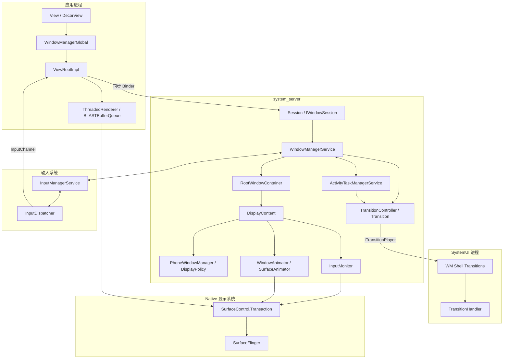
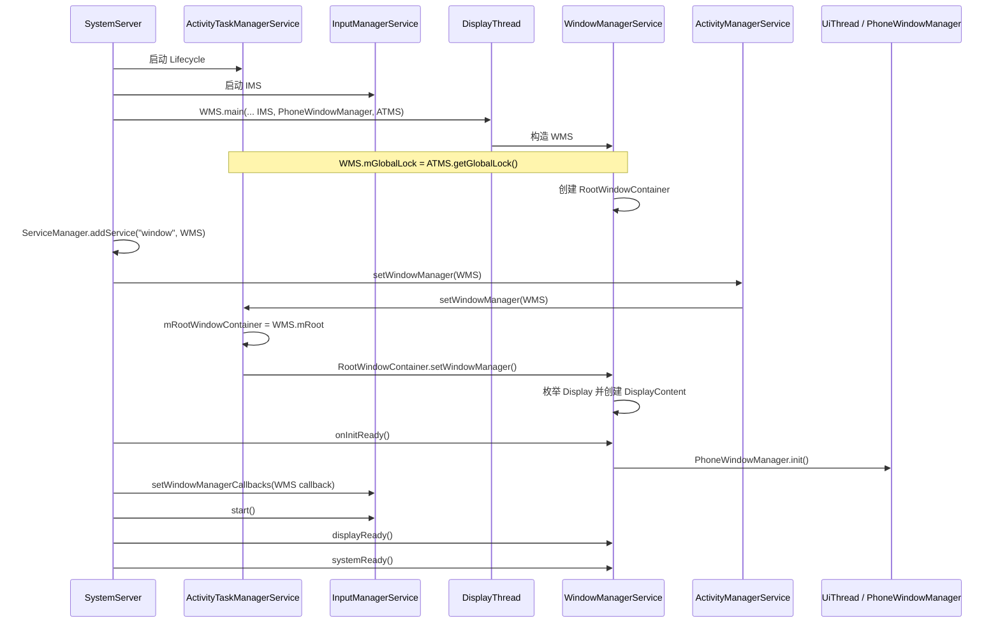
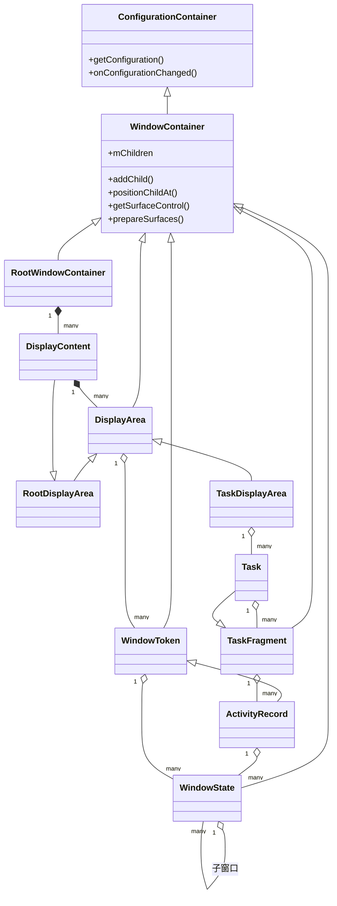
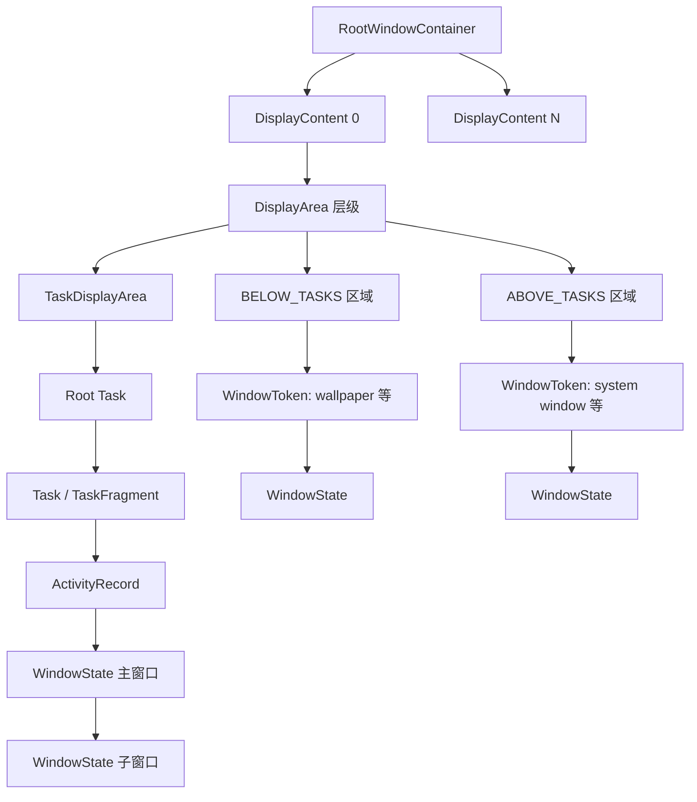
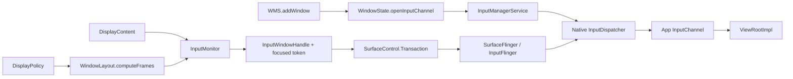

# Android 17 WMS 架构与核心对象

## 基线与边界

本文对应：

- `android17-release`
- `frameworks/base@94b4c163b7df`
- tag `android-17.0.0_r1`

WMS 不是一个只负责窗口坐标的独立 Binder 服务。它与 ATMS 共用全局锁和 `RootWindowContainer`，与 IMS 双向协作，把窗口状态转成 SurfaceControl transaction，并把任务级转场交给 SystemUI 进程中的 WM Shell。

---

## 总体框架图



### 图中最重要的四个边界

1. **ViewRootImpl 与 WMS**：通过 `IWindowSession` 跨进程，不是直接调用 WMS。
2. **WMS 与 ATMS**：服务职责不同，但共享 `WindowManagerGlobalLock` 和 Root 容器树。
3. **WMS 与 IMS**：WMS 提供窗口/InputChannel/焦点信息，IMS 反向回调 ANR、焦点和策略事件。
4. **WMS 与 SurfaceFlinger/WM Shell**：前者通过 transaction 提交 Surface 状态，任务级转场通过 `ITransitionPlayer` 交给 Shell。

---

## 启动框架图



### 启动源码入口

| 入口 | 本地源码 |
|------|----------|
| IMS/WMS 启动顺序 | `services/java/com/android/server/SystemServer.java:1738` |
| `WindowManagerService.main()` | `services/core/java/com/android/server/wm/WindowManagerService.java:1289` |
| DisplayThread 构造 | `WindowManagerService.java:1321` |
| 共享全局锁 | `WindowManagerService.java:1352` |
| 创建 Root | `WindowManagerService.java:1396` |
| ATMS 接收 WMS/Root | `ActivityTaskManagerService.java:1073` |
| Root 枚举 Display | `RootWindowContainer.java:1154` |
| Policy 初始化 | `WindowManagerService.java:1624` |

---

## 核心类 UML



### 继承关系不等于运行时父子关系

UML 中有两种箭头：

- `<|--`：Java 继承，说明能力复用。
- `*-- / o--`：运行时容器关系，说明节点挂在哪里。

例如：

- `ActivityRecord extends WindowToken` 是继承关系。
- 某个 `ActivityRecord` 挂在 `TaskFragment` 下是运行时容器关系。
- `ActivityRecord` 下面再挂 `WindowState`，形成应用窗口分支。

不要把这三层关系合并成一条“类继承树”。

---

## 运行时容器框架图



### 两条主分支

**应用窗口**

```text
TaskDisplayArea -> root Task -> Task/TaskFragment -> ActivityRecord -> WindowState
```

**非应用窗口**

```text
DisplayArea.Tokens -> WindowToken -> WindowState
```

`WindowContainer.mChildren` 按 Z-order 排列，尾部是最上层。DisplayArea 的 `BELOW_TASKS / ABOVE_TASKS / ANY` 类型进一步约束不同窗口能出现在哪个层级。

---

## 核心对象职责

| 对象 | 本质职责 | 不应误解为 |
|------|----------|------------|
| `WindowManagerService` | Binder 服务入口、全局协调、权限与状态变更 | 所有窗口算法都写在一个类里 |
| `RootWindowContainer` | 设备级显示根、跨 Display 遍历 | 单个屏幕 |
| `DisplayContent` | 单个逻辑 Display 的窗口、策略、输入与 Surface 状态根 | 物理屏幕驱动 |
| `DisplayArea` | 对 DisplayContent 子树按用途和 Z-order 分组 | 旧版 TaskStack 的简单替代 |
| `TaskDisplayArea` | 承载 root Task/Task 的任务区域 | 任意 WindowToken 容器 |
| `TaskFragment` | Activity/嵌套 TaskFragment 的生命周期与可见性容器 | 仅嵌入式 TaskFragment API |
| `Task` | 任务语义、可嵌套、可作为 root Task | 所有 Task 都等于旧 TaskStack |
| `ActivityRecord` | Activity 服务端记录，同时作为应用窗口 token | 只属于 AMS 的 Activity 信息 |
| `WindowToken` | 一组 WindowState 的 token/容器 | 仅应用窗口 token |
| `WindowState` | 单个窗口的服务端状态、frame、输入和 Surface 关联 | 客户端 View |

---

## 线程、Binder 与锁

| 场景 | 主要线程 | 锁/同步边界 |
|------|----------|-------------|
| `WindowManagerGlobal.addView()` | 应用 UI 线程 | `WindowManagerGlobal.mLock` |
| `ViewRootImpl.setView()/performTraversals()` | 应用 UI 线程 | ViewRoot 线程亲和性、Choreographer |
| `Session.addToDisplay/relayout()` | system_server Binder 线程 | 进入 WMS 后获取 `mGlobalLock` |
| WMS 构造 | DisplayThread | `runWithScissors()` 同步等待 |
| `PhoneWindowManager.init()` | UiThread | `runWithScissors()` 同步等待 |
| `WindowSurfacePlacer` traversal | AnimationThread handler | Traverser 获取 `mGlobalLock` |
| `WindowAnimator.animate()` | AnimationThread/Choreographer | 合并 pending transaction 后 apply |
| `SurfaceAnimationRunner` | SurfaceAnimationThread | 独立 animation transaction |

### 共享全局锁的意义

WMS 与 ATMS 操作的是同一棵 Activity/窗口容器树。若 Activity 可见性、Task 位置和 WindowState 层级分别用无关锁保护，很容易出现生命周期已变化但窗口树仍是旧状态的问题。因此本版本通过 `WindowManagerGlobalLock` 协调关键状态。

这不代表所有耗时操作都应在锁内执行。阅读源码时应持续检查：

- Binder 回调是否在锁内发生？
- 是否先 `Binder.clearCallingIdentity()`？
- Surface transaction 是立即 apply，还是写入 pending transaction？
- 是否通过 Handler/Choreographer 延后执行？

---

## 输入与策略框架图



当前版本由 transaction 同步输入窗口几何和 focused token，不应画成 `InputMonitor` 直接调用 `InputDispatcher.setInputWindows()`。

---

## 版本迁移对照

| 旧 Android 9 常见术语 | Android 17 本地源码 |
|-----------------------|---------------------|
| `AppWindowToken` | `ActivityRecord extends WindowToken` |
| `TaskStack` | `TaskDisplayArea` 下的 root `Task` 最接近旧语义；不能一对一替换全部 `Task` |
| `AppTransition` 主控 | `TransitionController/Transition` + WM Shell `Transitions` |
| `WindowSurfaceController` | 职责分散到 `WindowStateAnimator`、`WindowState`、`ViewRootImpl`、Transaction |
| 单一 server Surface 创建路径 | client-surface 与 server-surface 兼容路径并存 |
| 旧文件式 WM trace | Perfetto/Winscope 数据源 |

---

## 源码索引

- `services/core/java/com/android/server/wm/WindowContainer.java:117`
- `services/core/java/com/android/server/wm/RootWindowContainer.java:167`
- `services/core/java/com/android/server/wm/DisplayContent.java:299`
- `services/core/java/com/android/server/wm/DisplayArea.java:58`
- `services/core/java/com/android/server/wm/TaskDisplayArea.java:73`
- `services/core/java/com/android/server/wm/TaskFragment.java:123`
- `services/core/java/com/android/server/wm/Task.java:207`
- `services/core/java/com/android/server/wm/ActivityRecord.java:372`
- `services/core/java/com/android/server/wm/WindowToken.java:63`
- `services/core/java/com/android/server/wm/WindowState.java:277`
- `services/core/java/com/android/server/wm/InputMonitor.java:78`
- `services/core/java/com/android/server/wm/TransitionController.java:109`

---

## 自测问题

1. 为什么 `ActivityRecord` 既属于 Activity 管理，又能成为 WindowToken？
2. Java 继承树、WindowContainer 运行时树、SurfaceControl 树分别解决什么问题？
3. 为什么每个 Display 都需要自己的 `DisplayPolicy` 和 `InputMonitor`？
4. `Task` 与旧 `TaskStack` 为什么不能简单一一替换？
5. 哪些调用在应用 UI 线程，哪些在 system_server Binder/Animation/Display/UI 线程？
