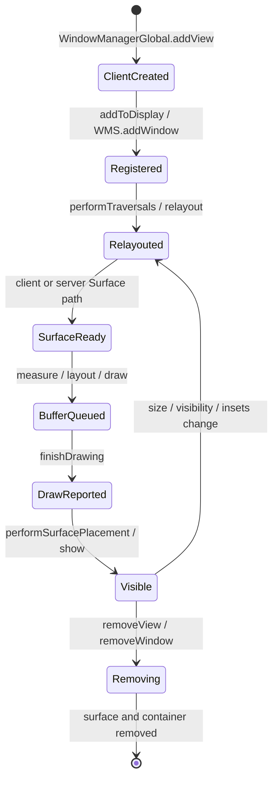
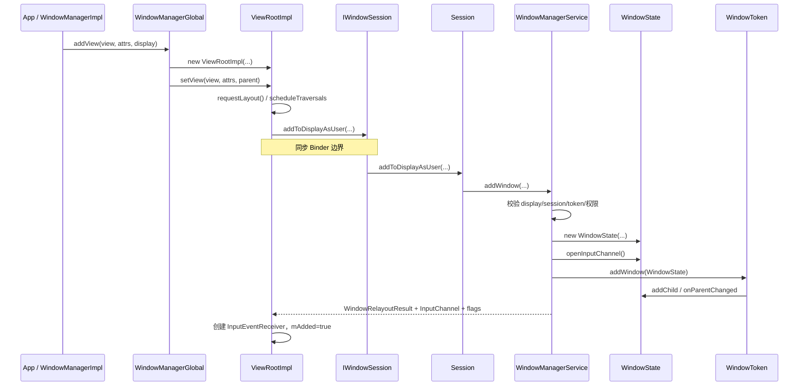
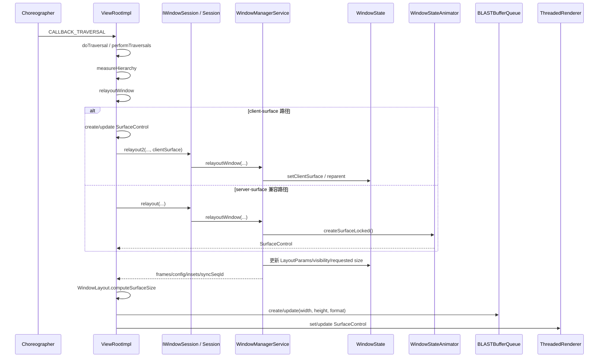
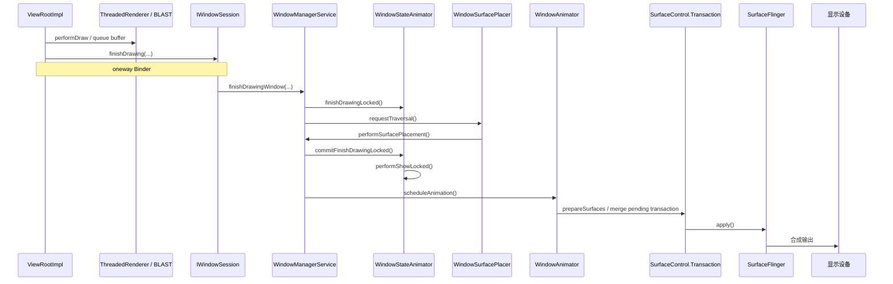
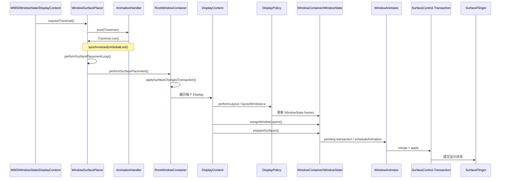
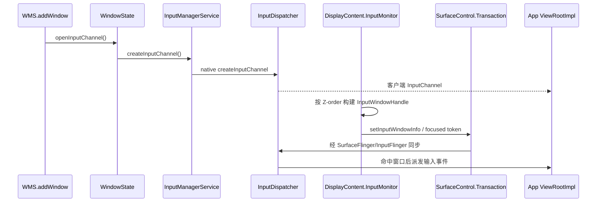

# Android 17 WMS 窗口生命周期与 Surface 主链

## 基线

- `android17-release`
- `frameworks/base@94b4c163b7df`

本文只讨论普通应用窗口从 `addView()` 到首帧显示的主链。Starting Window、Windowless WindowManager、嵌入式 SurfaceControlViewHost 和特殊系统窗口是后续专题。

---

## 本质

“添加窗口”和“显示窗口”不是同一件事。一个普通窗口至少经历：

```text
创建 ViewRootImpl
 -> 在 WMS 注册 WindowState
 -> 首次 traversal/relayout
 -> 建立或接管 SurfaceControl
 -> 客户端 measure/layout/draw 并提交 buffer
 -> finishDrawing 通知 WMS
 -> WMS 更新可见性并提交 transaction
 -> SurfaceFlinger 合成
```

这条链横跨应用 UI 线程、同步 Binder、system_server Binder 线程、AnimationThread、RenderThread 和 SurfaceFlinger。

---

## 阶段总图



---

## 主链一：addView 到 addWindow



### addWindow 完成什么

- 校验 Session、Display、WindowToken、窗口类型和权限。
- 创建并注册 `WindowState`。
- 必要时创建 InputChannel。
- 将窗口挂入 `WindowToken/WindowContainer` 树。
- 初始化策略、Insets、焦点候选和层级相关状态。
- 返回初始 frame/config/insets/input 数据。

### addWindow 没有完成什么

- 没有完成最终窗口 frame 计算。
- 没有让应用 View 完成 measure/layout/draw。
- 没有保证客户端 buffer 已提交。
- 没有保证 Surface 已经对用户可见。

源码在 addWindow 流程中明确要求客户端继续发起 relayout。把 `addWindow()` 等同于“窗口已经显示”，是阅读 WMS 最常见的错误之一。

### 线程与锁

- `WindowManagerGlobal.addView()`、`ViewRootImpl.setView()`：应用 UI 线程。
- `ViewRootImpl` 通过 `checkThreadCompat()` 保证线程亲和性。
- `addToDisplayAsUser()`：同步 Binder。
- `Session/WMS.addWindow()`：system_server Binder 线程。
- WMS 核心状态修改：持有共享 `mGlobalLock`。

---

## 主链二：首次 traversal 与 relayout



### Android 17 的两条 Surface 路径

**Client-surface 路径**

```text
ViewRootImpl.createSurfaceControl
 -> relayout2(surface)
 -> WindowState.setClientSurface
 -> Transaction.reparent(clientSurface, WindowState.mSurfaceControl)
```

**Server-surface 兼容路径**

```text
WMS.createSurfaceControl
 -> WindowStateAnimator.createSurfaceLocked
 -> SurfaceControl.Builder.setBLASTLayer
 -> 返回 SurfaceControl 给 ViewRootImpl
```

当前源码没有 `WindowSurfaceController.java`。旧资料中该类的职责已分散到：

- `WindowStateAnimator`
- `WindowState`
- `ViewRootImpl`
- `SurfaceControl.Transaction`

`WindowStateAnimator.createSurfaceLocked()` 中仍出现 `WindowSurfaceController` callsite 字符串，只是历史痕迹，不代表类仍存在。

---

## 主链三：客户端绘制到首帧显示



### 为什么需要 finishDrawing

WMS 不能只凭 relayout 就认定窗口已经准备好。客户端可能还没产生首个 buffer。`finishDrawing` 把“服务端 Surface/窗口状态已准备”与“客户端完成绘制”连接起来，避免暴露空白或未完成内容。

---

## 主链四：全局 Surface placement



### 三个不能混淆的阶段

| 阶段 | 主要结果 | 代表入口 |
|------|----------|----------|
| 布局 | WindowState frame、Insets 相关几何 | `DisplayContent.performLayout()` |
| 分层 | SurfaceControl layer/relative layer | `assignWindowLayers()` |
| Surface 提交 | position、crop、alpha、show/hide 等 | `prepareSurfaces()` + `Transaction.apply()` |

### 调度与防循环

- `requestTraversal()` 使用 `mAnimationHandler` 合并多个请求。
- Traverser 在 `mGlobalLock` 内执行。
- 布局可通过 `deferLayout()/continueLayout()` 批量延后。
- 连续布局最多执行 6 次；仍反复请求时记录错误，避免无限循环。

### Surface placement 不只是“摆 Surface”

根遍历后还会：

- 处理 resizing windows。
- 分发 ATMS lifecycle transaction。
- 分发 Task/TaskFragment organizer 事件。
- 通知 BLAST sync engine。
- 更新焦点、输入、亮度、用户活动超时等显示级状态。

因此它是 WMS 多子系统的统一提交点。

---

## 输入链如何嵌入窗口生命周期



当前版本的窗口几何和焦点通过 Surface transaction 同步，不是 `InputMonitor` 直接调用 Java `InputDispatcher.setInputWindows()`。

---

## 关键源码索引

### 客户端

- `core/java/android/view/WindowManagerImpl.java:185`
- `core/java/android/view/WindowManagerGlobal.java:409`
- `core/java/android/view/ViewRootImpl.java:1649`
- `core/java/android/view/ViewRootImpl.java:2842`
- `core/java/android/view/ViewRootImpl.java:3924`
- `core/java/android/view/ViewRootImpl.java:10191`
- `core/java/android/view/IWindowSession.aidl:52`

### 服务端

- `services/core/java/com/android/server/wm/Session.java:264`
- `services/core/java/com/android/server/wm/WindowManagerService.java:1672`
- `services/core/java/com/android/server/wm/WindowManagerService.java:2548`
- `services/core/java/com/android/server/wm/WindowManagerService.java:3058`
- `services/core/java/com/android/server/wm/WindowState.java:3412`
- `services/core/java/com/android/server/wm/WindowStateAnimator.java:287`
- `services/core/java/com/android/server/wm/WindowSurfacePlacer.java:112`
- `services/core/java/com/android/server/wm/WindowSurfacePlacer.java:219`
- `services/core/java/com/android/server/wm/RootWindowContainer.java:739`
- `services/core/java/com/android/server/wm/DisplayContent.java:4549`
- `services/core/java/com/android/server/wm/WindowAnimator.java:114`

---

## 常见问题

### 1. WindowState 的 SurfaceControl 就是应用 buffer 吗？

不是一个概念。WindowState 容器 Surface、client Surface、BLASTBufferQueue 以及动画 leash 可能形成多层 SurfaceControl 关系。阅读时应分别追踪创建者、父节点和 buffer 来源。

### 2. relayout 为什么可能触发全局遍历？

LayoutParams、可见性、Insets、orientation、焦点或 Surface 状态变化可能影响其他窗口和整个 Display，因此不能只局部更新当前窗口。

### 3. 为什么 Surface transaction 不在每个 setter 后立即 apply？

合并 transaction 可以让 frame、层级、可见性、输入窗口信息和动画在同一个显示帧原子生效，减少中间不一致状态。

---

## 自测问题

1. addWindow 返回后，服务端和客户端分别已经具备哪些对象？
2. client-surface 与 server-surface 路径在哪里汇合？
3. 首帧为何需要 finishDrawing，而不能 relayout 后直接 show？
4. `performLayout`、`assignWindowLayers`、`prepareSurfaces` 的输出分别是什么？
5. 输入窗口几何如何与 Surface transaction 保持一致？
