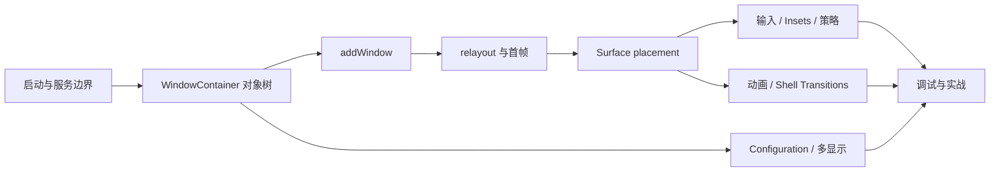

# Android 17 WMS 系统学习路线

## 基线

- 源码根目录：`/home/zj970/android/aosp-last/frameworks/base`
- Manifest：`android17-release`
- `frameworks/base` commit：`94b4c163b7dfe5ce3607f7bb8456f9573f7de57d`
- Release tag：`android-17.0.0_r1`
- `git describe`：`android-vts-17.0_r1`

本文所有类名、方法和图都以该提交为准。源码更新后应先重新核对行号与类关系。

已有 [AOSP9-wm-size-Configuration链路](/home/zj970/ai-study/KNOWLEDGE/Framework/AOSP9-wm-size-Configuration链路.md) 只用于历史版本对照。Android 17 已使用 `DisplayArea`、`TaskFragment`、Shell Transitions 和新的多显示配置路径，不能直接套用 Android 9 的 `AppWindowToken/TaskStack/AppTransition` 模型。

---

## 问题分析

WMS 难学，不是因为单个方法特别复杂，而是因为同一个窗口状态横跨多个维度：

- 应用进程的 View、ViewRootImpl 和 RenderThread
- system_server 中共用状态树的 ATMS/WMS
- InputManager/InputDispatcher 的输入目标
- SurfaceControl、SurfaceFlinger 的显示事务
- SystemUI 进程中的 WM Shell Transitions
- Binder、DisplayThread、AnimationThread、UiThread 等线程边界

如果按文件名逐个读 268 个 `wm` 类，容易得到碎片。正确顺序是先建立对象树，再跟四条主链：



---

## 能力目标

当前建议定位为 **L2 向 L3 过渡**。

### L2 的典型表现

- 能通过 `rg` 找到入口方法。
- 能跟一条已知调用链。
- 能使用 `dumpsys window` 查看状态。

### WMS 方向的 L3 完成标准

- 面对窗口、焦点、旋转、黑屏或转场问题，能先判断所属子系统。
- 能说明对象归属、线程/Binder 边界和持锁范围。
- 能用 dumpsys、ProtoLog、Perfetto/Winscope 建立运行时证据。
- 能选择相关 `WmTests-wm-*` 测试并形成回归矩阵。
- 能独立完成一个小型 WMS 定制或故障分析。

---

## 八周计划

| 周次 | 主题 | 主源码 | 实践证据 | 阶段交付 |
|------|------|--------|----------|----------|
| 第 1 周 | 版本、启动、服务边界 | `SystemServer`、`WMS.main()`、`ATMS.setWindowManager()` | `dumpsys window -h/displays` | 启动框架图 |
| 第 2 周 | WindowContainer 对象树 | `WindowContainer`、`DisplayArea`、`Task/ActivityRecord/WindowState` | `dumpsys window containers` | 核心类 UML |
| 第 3 周 | 窗口添加与移除 | `WindowManagerGlobal`、`ViewRootImpl`、`Session`、`WMS.addWindow()` | 日志对齐 UI/Binder 线程 | addWindow 时序图 |
| 第 4 周 | relayout、首帧、Surface 遍历 | `relayoutWindow`、`WindowStateAnimator`、`WindowSurfacePlacer` | Perfetto/Winscope 首帧证据 | 首帧与 traversal 图 |
| 第 5 周 | 焦点、输入、Insets、策略 | `InputMonitor`、`DisplayPolicy`、`WindowLayout` | `dumpsys window` + `dumpsys input` | 输入/Frame 专题 |
| 第 6 周 | Surface 动画与 Shell Transitions | `SurfaceAnimator`、`TransitionController`、WM Shell `Transitions` | Activity 启停 trace | Transition 状态图 |
| 第 7 周 | Configuration、旋转、多显示 | `DisplayContent`、`RootWindowContainer`、`WindowManagerShellCommand` | `wm size/density`、VirtualDisplay | 多显示配置分支图 |
| 第 8 周 | 调试、测试、真实改动 | `WmTests` 与目标模块 | atest + dumpsys + trace | 实战复盘文档 |

---

## 分阶段解决路径

### 阶段 1：启动和服务边界

先回答三个问题：

1. 为什么 WMS 构造发生在 DisplayThread，而 Binder 调用不一定运行在该线程？
2. 为什么 WMS 和 ATMS 共用 `WindowManagerGlobalLock`？
3. 为什么 ATMS 的 `mRootWindowContainer` 最终指向 `wm.mRoot`？

阅读顺序：

1. `services/java/com/android/server/SystemServer.java:1738`
2. `services/core/java/com/android/server/wm/WindowManagerService.java:1289`
3. `services/core/java/com/android/server/wm/ActivityTaskManagerService.java:1073`
4. `services/core/java/com/android/server/wm/RootWindowContainer.java:1154`

验收：不看资料画出 IMS、WMS、ATMS、PhoneWindowManager 的启动顺序，并标出 DisplayThread、UiThread 和共享锁。

### 阶段 2：对象树和状态归属

不要先背所有类。先区分两条容器分支：

```text
应用窗口：TaskDisplayArea -> Task/TaskFragment -> ActivityRecord -> WindowState
系统窗口：DisplayArea.Tokens -> WindowToken -> WindowState
```

重点理解：

- `mChildren` 是 Z-order，不只是普通列表。
- `WindowContainer` 同时承载 Configuration 和 Surface/动画能力。
- `ActivityRecord extends WindowToken` 连接 Activity 生命周期与窗口树。
- `WindowState extends WindowContainer<WindowState>` 支持父子窗口。

验收：从一次真实 `dumpsys window containers` 中选择 10 个节点，写出各自 Java 类型、父节点和状态职责。

### 阶段 3：addWindow

主链：

```text
WindowManagerImpl
 -> WindowManagerGlobal.addView
 -> ViewRootImpl.setView
 -> IWindowSession.addToDisplayAsUser
 -> Session.addToDisplayAsUser
 -> WMS.addWindow
 -> WindowToken.addWindow
```

要主动寻找的边界：

- `ViewRootImpl` 为什么先 `requestLayout()` 再发 Binder 请求？
- `addWindow()` 为什么只注册窗口，不能等同“窗口已经显示”？
- token、权限、InputChannel、WindowState 和初始 Z-order 分别在哪一步处理？

验收：解释 addWindow 返回后仍需 relayout、draw、finishDrawing 的原因。

### 阶段 4：relayout、首帧与 Surface placement

必须拆开四件事：

1. `performLayout` 计算窗口 frame。
2. `assignWindowLayers` 计算 Surface Z-order。
3. 应用通过 BLASTBufferQueue/Renderer 产生 buffer。
4. `prepareSurfaces + Transaction.apply` 提交位置、裁剪、透明度和显示状态。

Android 17 同时存在 client-surface 与 server-surface 兼容路径，不能只读 `WindowStateAnimator.createSurfaceLocked()`。

验收：录制一次 Activity 冷启动，找出 relayout、draw、finishDrawing、performShow 和 SurfaceFlinger 提交的大致先后关系。

### 阶段 5：输入、Insets 和策略

分两条链学习：

```text
窗口注册 -> openInputChannel -> IMS -> native InputDispatcher
DisplayContent/InputMonitor -> InputWindowHandle/focused token -> Surface transaction
```

同时区分：

- `PhoneWindowManager`：系统级设备和按键策略。
- `DisplayPolicy`：每个 Display 的布局、System Bar、Insets 策略。
- `WindowLayout.computeFrames()`：具体 frame 计算。

验收：用两个 Activity、IME 和 Overlay 解释窗口焦点、输入焦点和触摸目标的差异。

### 阶段 6：动画和 Shell Transitions

先局部、后全局：

1. `SurfaceAnimator` 如何建立 leash 并 reparent。
2. `SurfaceAnimationRunner` 如何按帧执行 `AnimationSpec`。
3. `TransitionController/Transition` 如何收集参与者和同步事务。
4. WM Shell 如何选择 `TransitionHandler` 并回调 finish。

验收：能回答“`AppTransition.java` 去哪里了”和“`WindowAnimator` 为什么仍存在”。

### 阶段 7：Configuration 和多显示

本地 Android 17 的 `wm size` 已不是旧 Android 9 的默认屏单一路径。重点跟踪：

```text
WindowManagerShellCommand
 -> WMS.setForcedDisplaySize
 -> DisplayContent.setForcedSize
 -> reconfigureDisplayLocked
 -> computeScreenConfiguration
 -> global 或 per-display override Configuration
```

验收：画出默认屏和副屏的配置分支，并在实验结束后恢复 `wm size/density reset`。

### 阶段 8：真实问题闭环

候选题目只选一个：

- 修正一种窗口策略或 Insets 行为。
- 增加一个只在 debug 构建启用的 WMS 状态输出。
- 分析并修复一个多显示焦点/窗口层级问题。
- 调整一个局部 Surface 动画或 Shell Transition 行为。

验收文档必须包含：现象、假设、源码证据、运行时证据、改动、测试矩阵、风险与回滚方式。

---

## 文档索引

1. [Android17-WMS架构与核心对象](/home/zj970/ai-study/KNOWLEDGE/Framework/Android17-WMS架构与核心对象.md)
2. [Android17-WMS窗口生命周期与Surface主链](/home/zj970/ai-study/KNOWLEDGE/Framework/Android17-WMS窗口生命周期与Surface主链.md)
3. [Android17-WMS调试与实验手册](/home/zj970/ai-study/KNOWLEDGE/Framework/Android17-WMS调试与实验手册.md)
4. [AOSP9-wm-size-Configuration链路（历史对照）](/home/zj970/ai-study/KNOWLEDGE/Framework/AOSP9-wm-size-Configuration链路.md)

---

## 常见错误

- 只看 `WindowManagerService.java`，忽略 ViewRootImpl、ATMS、IMS、SurfaceFlinger 和 WM Shell。
- 把 `addWindow()` 当成窗口已经绘制并显示。
- 把容器父子关系、Java 继承关系和 SurfaceControl 父子关系混为一谈。
- 用 Android 9 的 `AppWindowToken/TaskStack/AppTransition` 名称解释 Android 17。
- 只收集日志，不先写问题和预期调用链。
- 一次阅读过多类，没有用 dumpsys 或 trace 验证任何结论。

---

## 个人理解

WMS 的核心不是“管理几个窗口 API”，而是把 Activity 生命周期、窗口层级、输入命中、显示配置和 Surface 事务约束到一棵可遍历、可同步、可动画的状态树中。

学习 WMS 的最短路径不是记住更多类，而是持续回答三件事：

1. 这份状态属于哪个对象？
2. 谁在什么线程、持什么锁修改它？
3. 修改何时通过 Binder 或 Surface transaction 对外生效？
