# Android 9 Launcher3 架构与开发指南

## 文档范围

- 源码目录：`/home/zj970/android/aosp-last/packages/apps/Launcher3`
- 源码版本：Android 9 `pi-release` 时代 Launcher3
- 核心模块：普通 `Launcher3`
- 同时说明：`Launcher3Go`、`Launcher3QuickStep`、`Launcher3QuickStepGo` 的构建差异
- 目标：帮助开发者快速理解启动、模型、视图、状态、拖拽和持久化链路，并找到常见需求的修改入口

本文严格以当前源码树为依据。不同 Android 版本中的 Launcher3 类名和架构可能已经变化，不能直接套用新版实现。

## 一、核心结论

1. 当前 Launcher3 没有自定义 `Application`；进程最早创建的组件是 `LauncherProvider`。
2. `LauncherAppState` 是主线程按需创建的进程级单例，不是 `Application` 子类。
3. `Launcher` 是 HOME Activity，也是 UI、模型回调、状态机和拖拽系统的总协调者。
4. `LauncherModel` 使用单独的 `HandlerThread("launcher-loader")` 串行执行模型任务。
5. `LoaderTask` 在后台线程加载 Workspace、All Apps、Deep Shortcut 和 Widgets。
6. `LoaderResults` 复制后台模型快照，通过 `MainThreadExecutor` 把 View 绑定切回主线程。
7. Workspace 用户布局持久化在 `launcher.db`；All Apps 列表由系统应用信息动态重建，不写入 Workspace 数据库。
8. `DragController` 负责拖拽事件分发，`Workspace`、文件夹和删除区域等对象实现 `DropTarget`。
9. `LauncherStateManager` 不直接写死所有动画，而是把状态应用给一组 `StateHandler`。
10. 普通 Launcher 和 Quickstep 通过不同 source set 提供同包同类名的 `UiFactory`，编译时二选一。

## 二、源码与构建结构

### 2.1 目录职责

| 路径 | 作用 |
|---|---|
| `Android.mk` | AOSP Make 构建入口，定义 Launcher3、Go、Quickstep 等变体 |
| `AndroidManifest.xml` | HOME Activity、LauncherProvider 和 SettingsActivity |
| `AndroidManifest-common.xml` | 各变体共享组件、权限、Receiver 和 Service |
| `src/` | Launcher3 公共核心代码 |
| `src_ui_overrides/` | 普通 Launcher 的 UI 覆盖实现 |
| `src_flags/` | 普通版本 FeatureFlags |
| `go/` | Android Go 资源、Manifest 和 FeatureFlags |
| `quickstep/` | Overview、Recents、手势导航及 SystemUI 集成 |
| `res/` | 公共布局、尺寸、字符串、默认 Workspace 等资源 |
| `tests/` | Instrumentation、Provider、Model、Widget 和 UI 测试 |
| `protos/` | Launcher dump 和用户行为日志 Proto |

当前目录存在 `Android.mk`，不存在 `Android.bp`。完整 AOSP 产品构建应以 `Android.mk` 为准，`build.gradle` 主要用于 Android Studio 调试。

### 2.2 构建变体

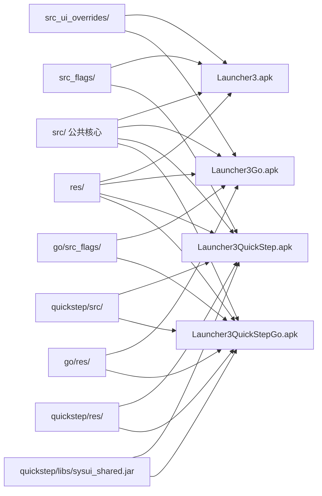

关键构建位置：

- 普通版：`Android.mk:32-78`
- Go 版：`Android.mk:80-132`
- Quickstep：`Android.mk:134-186`
- Quickstep Go：`Android.mk:188-238`

### 2.3 Source set 替换机制

普通版和 Quickstep 都存在：

```text
com.android.launcher3.uioverrides.UiFactory
```

但来源不同：

- 普通版：`src_ui_overrides/com/android/launcher3/uioverrides/UiFactory.java`
- Quickstep：`quickstep/src/com/android/launcher3/uioverrides/UiFactory.java`

二者不会在同一个 APK 中同时编译。修改这类同包同类名文件前，必须先确认产品实际使用哪个 Launcher 模块。

## 三、总体框架

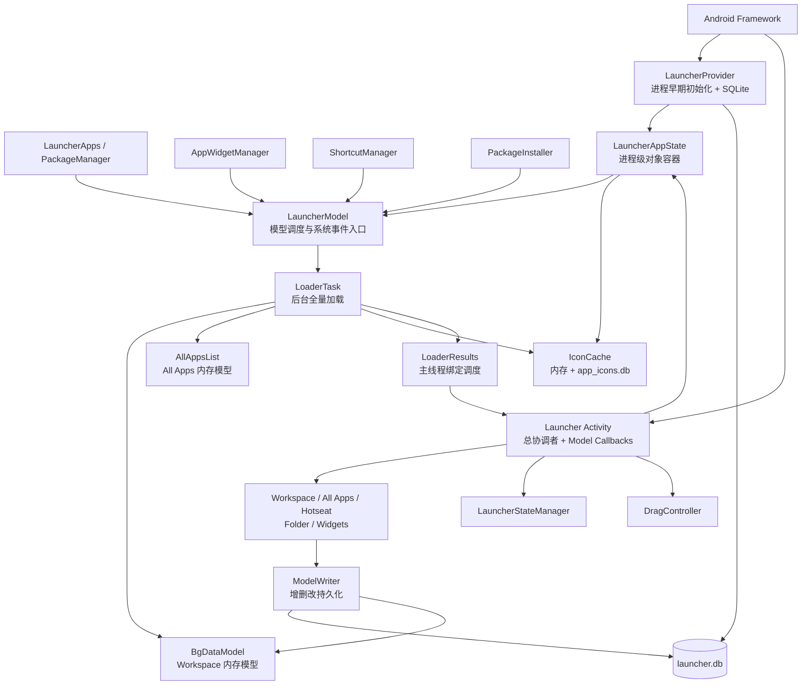

可以把 Launcher3 分成六层：

| 层次 | 核心对象 | 主要职责 |
|---|---|---|
| 系统入口 | `LauncherProvider`、`Launcher` | 进程初始化、HOME Activity 入口 |
| 全局对象 | `LauncherAppState` | 持有 Model、IconCache、DeviceProfile 等 |
| 模型调度 | `LauncherModel` | Loader 生命周期、系统事件、线程切换 |
| 数据模型 | `BgDataModel`、`AllAppsList` | Workspace 和 All Apps 的内存真相 |
| UI/交互 | `Workspace`、`CellLayout`、`DragController` | 页面、网格、状态和拖拽 |
| 持久化 | `LauncherProvider`、`ModelWriter` | SQLite CRUD、默认布局、迁移和恢复 |

## 四、进程启动与 Activity 初始化

### 4.1 HOME Activity 入口

`AndroidManifest.xml:68-87` 声明 `com.android.launcher3.Launcher`：

```text
ACTION_MAIN + CATEGORY_HOME + CATEGORY_DEFAULT
```

关键属性：

- `launchMode="singleTask"`
- `stateNotNeeded="true"`
- 自己处理 `orientation|screenSize|screenLayout|smallestScreenSize` 等配置变化
- `resizeableActivity="true"`

### 4.2 没有自定义 Application

Manifest 的 `<application>` 没有 `android:name`。正确启动认知是：

```text
默认 Application
    -> LauncherProvider.onCreate()
    -> MainProcessInitializer.initialize()
    -> Launcher.onCreate()
    -> LauncherAppState.getInstance()
```

`LauncherProvider.java:115-117` 明确说明 Provider 在 Launcher 主进程整个生命周期内存在，并且是第一个被创建的组件。

### 4.3 冷启动时序图

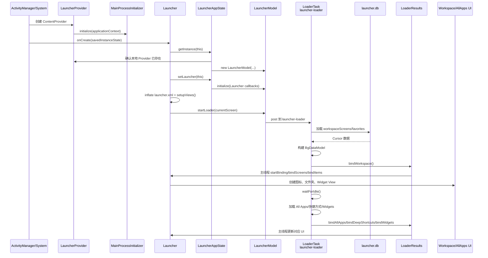

### 4.4 `Launcher.onCreate()` 主链

核心位置：`Launcher.java:255-350`。

```text
Launcher.onCreate()
    -> super.onCreate()
    -> LauncherAppState.getInstance()
    -> LauncherAppState.setLauncher(this)
    -> initDeviceProfile()
    -> new DragController()
    -> new AllAppsTransitionController()
    -> new LauncherStateManager()
    -> LauncherAppWidgetHost.startListening()
    -> inflate(R.layout.launcher)
    -> setupViews()
    -> restoreState()
    -> LauncherModel.startLoader()
    -> setContentView()
```

注意：`startLoader()` 发生在 `setContentView()` 之前，但布局已经 inflate 并执行了 `setupViews()`，因此模型回调所需的 View 引用已经建立。

## 五、核心 UML 类图

### 5.1 总协调与模型类图

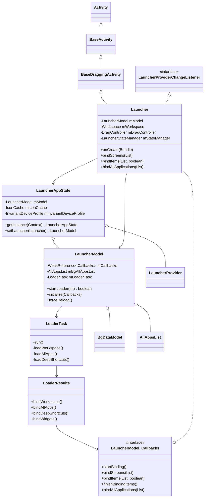

### 5.2 UI 类图

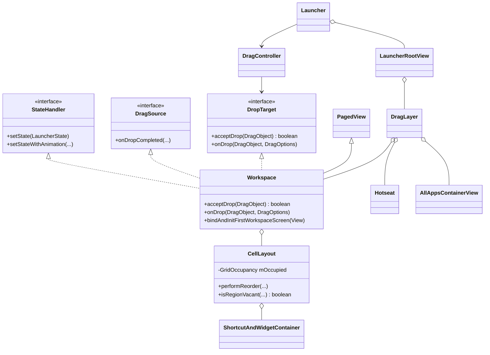

## 六、UI 层级

`res/layout/launcher.xml` 的静态结构如下：

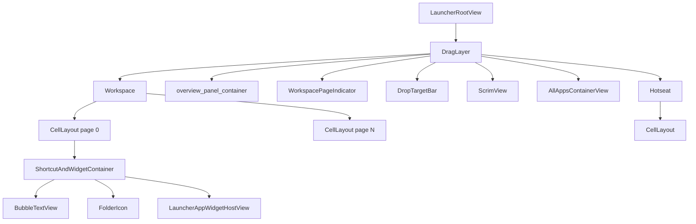

运行时还会把以下浮层动态加入 `DragLayer`：

- `DragView`
- `Folder`
- `PopupContainerWithArrow`
- `WidgetsFullSheet`
- `AppWidgetResizeFrame`
- 其他 `AbstractFloatingView`

当前源码中不存在 `WidgetsContainerView`，Widget 列表主要由 `WidgetsFullSheet`、`WidgetsBottomSheet`、`BaseWidgetSheet` 和 `WidgetsRecyclerView` 组成。

## 七、模型加载与线程模型

### 7.1 线程边界

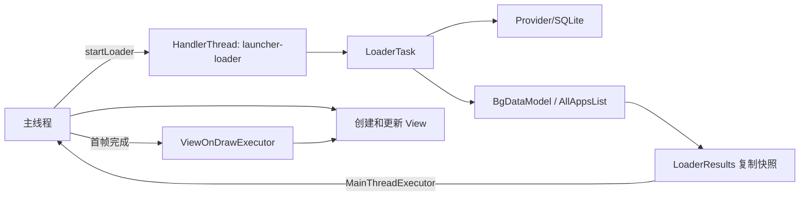

重要规则：

- `LauncherAppState` 首次构造必须在主线程。
- `LauncherModel.sWorkerThread` 是单个 HandlerThread，不是线程池。
- 全量 Loader 和大多数 ModelUpdateTask 在该线程串行执行。
- `BgDataModel` 的跨线程访问需要同步。
- 所有真实 View 操作必须回到主线程。
- 当前页优先绑定，其他页可延迟到首帧和加载动画完成之后。

### 7.2 Loader 四阶段

`LoaderTask.run()` 位于 `model/LoaderTask.java:157-227`：

```text
阶段 1：loadWorkspace -> bindWorkspace -> waitForIdle
阶段 2：loadAllApps -> bindAllApps -> updateIconCache -> waitForIdle
阶段 3：loadDeepShortcuts -> bindDeepShortcuts -> waitForIdle
阶段 4：widgetsModel.update -> bindWidgets -> commit
```

这种设计优先保证首屏可见，而不是等待所有数据都加载完成后一次性展示。

### 7.3 同步重绑定与冷启动

`LauncherModel.startLoader()` 有两个分支：

- 模型已加载：直接使用现有 `BgDataModel` 和 `AllAppsList` 重新绑定。
- 模型无效或首次启动：创建 `LoaderTask`，投递到 `launcher-loader`。

即使是“同步绑定”，非当前 Workspace 页仍可能通过 `ViewOnDrawExecutor` 延迟执行。

### 7.4 Model Callbacks

`Launcher` 直接实现 `LauncherModel.Callbacks`。高频回调包括：

| 回调 | 作用 |
|---|---|
| `startBinding()` | 清理旧 View，准备重新绑定 |
| `bindScreens()` | 创建和排序 Workspace 页面 |
| `bindItems()` | 绑定图标、文件夹和 Widget |
| `finishFirstPageBind()` | 完成首屏绑定并接入延迟执行器 |
| `finishBindingItems()` | 标记 Workspace 加载结束 |
| `bindAllApplications()` | 更新 All Apps 数据 |
| `bindDeepShortcutMap()` | 更新长按快捷方式数据 |
| `bindAllWidgets()` | 更新 Widget 列表 |

`LauncherModel` 使用 `WeakReference<Callbacks>`，避免进程级 Model 强引用已销毁的 Launcher Activity。

## 八、数据模型

### 8.1 ItemInfo UML

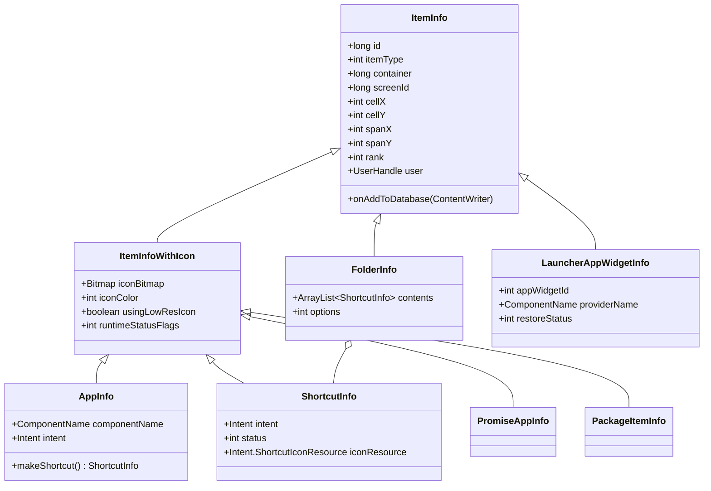

核心区分：

- `AppInfo`：All Apps 中的运行时对象，`container=NO_ID`，通常不写入 `launcher.db`。
- `ShortcutInfo`：Workspace 或 Folder 中可启动图标，可以持久化。
- `AppInfo.makeShortcut()`：从 All Apps 拖到 Workspace 时转换为 `ShortcutInfo`。
- `FolderInfo.contents`：内存中的文件夹内容；数据库通过子项 `container=folder.id` 表达关系。
- `runtimeStatusFlags`：每次创建对象时重新计算，不持久化。

### 8.2 BgDataModel

`BgDataModel` 是 Workspace 运行时内存模型：

| 集合 | 内容 |
|---|---|
| `itemsIdMap` | 所有持久化 Workspace 项，键为 Favorites `_id` |
| `workspaceItems` | Desktop/Hotseat 上的图标、快捷方式和文件夹，不含 Widget |
| `appWidgets` | 所有 Widget |
| `folders` | `folderId -> FolderInfo` |
| `workspaceScreens` | 有序 Workspace screen ID |
| `pinnedShortcutCounts` | Deep Shortcut pin 引用计数 |
| `deepShortcutMap` | Activity 到 Deep Shortcut ID 的映射 |
| `widgetsModel` | Widget 列表模型 |

### 8.3 AllAppsList

`AllAppsList` 不持久化全部应用，主要集合是：

- `data`：当前完整应用列表
- `added`：新增应用
- `removed`：删除应用
- `modified`：信息变化应用

逻辑唯一键是 `(ComponentName, UserHandle)`，一个包可以因为包含多个 Launcher Activity 而产生多个 `AppInfo`。

## 九、数据库与持久化

### 9.1 数据责任

| 数据 | 存储位置 | 是否可直接重建 |
|---|---|---|
| Workspace 图标、文件夹、Widget 和位置 | `launcher.db/favorites` | 否，属于用户布局 |
| Workspace 页面及顺序 | `launcher.db/workspaceScreens` | 不应随意丢失 |
| Workspace 内存对象 | `BgDataModel` | 可从数据库重建 |
| All Apps 应用列表 | `AllAppsList` | 可从 `LauncherApps` 重建 |
| 图标缓存 | `app_icons.db` | 可重建 |

### 9.2 ER 图

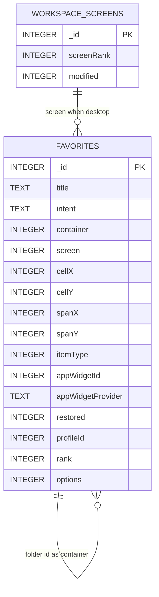

SQLite 中没有声明真正的外键；上图是 Java 层维护的逻辑关系。

### 9.3 Favorites 关键字段

| 字段 | 含义 |
|---|---|
| `_id` | Launcher 自己生成的 Item ID |
| `container` | `-100` Desktop、`-101` Hotseat，或父 Folder `_id` |
| `screen` | Desktop screen ID；Hotseat 时是规范化 rank |
| `cellX/cellY` | 网格位置 |
| `spanX/spanY` | 占用网格大小 |
| `itemType` | Application、Shortcut、Folder、Widget、Deep Shortcut 等 |
| `profileId` | User serial number |
| `restored` | 恢复、Promise App 或 Widget 恢复状态位 |
| `rank` | 文件夹或 Hotseat 中的顺序 |

Schema 版本是 27，定义于 `LauncherProvider.java:83`。

### 9.4 CRUD 时序

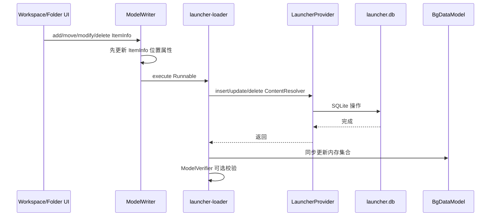

开发约束：

1. 不要只移动 View 而不调用 `ModelWriter`，否则重启后布局会恢复。
2. 不要只改数据库而不更新 `BgDataModel`，否则当前进程 UI 和数据库状态会分裂。
3. `ModelWriter` 的更新顺序通常是数据库完成后，再锁住 `BgDataModel` 更新内存。
4. `EXTRA_EMPTY_SCREEN_ID=-201` 不能持久化，落盘前必须转成正式 screen ID。
5. Hotseat 在横竖屏之间使用规范化位置，不能直接假设 `screen == cellX`。

## 十、状态机

### 10.1 状态集合

`LauncherState` 当前定义五个状态：

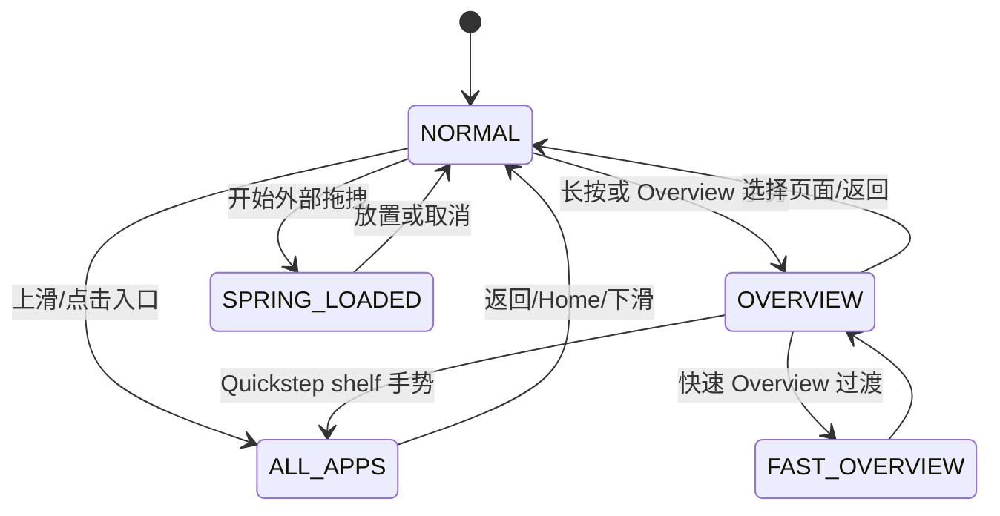

普通 Launcher 和 Quickstep 对状态的具体表现不同，但状态注册入口都在 `LauncherState.java:75-90`。

### 10.2 状态应用机制

```text
LauncherStateManager.goToState(target)
    -> 取消旧动画
    -> UiFactory.getStateHandler(Launcher)
    -> 每个 StateHandler.setStateWithAnimation()
    -> AnimatorSetBuilder.build()
    -> onStateTransitionStart()
    -> 动画执行
    -> onStateTransitionEnd()
```

普通版 `UiFactory.getStateHandler()` 返回：

- `AllAppsTransitionController`
- `Workspace`

Quickstep 额外返回：

- `RecentsViewStateController`
- `BackButtonAlphaHandler`

因此修改状态动画时，应先确定行为属于 Workspace、All Apps，还是 Quickstep Recents，不要把所有逻辑堆进 `LauncherStateManager`。

## 十一、拖拽框架

### 11.1 角色关系

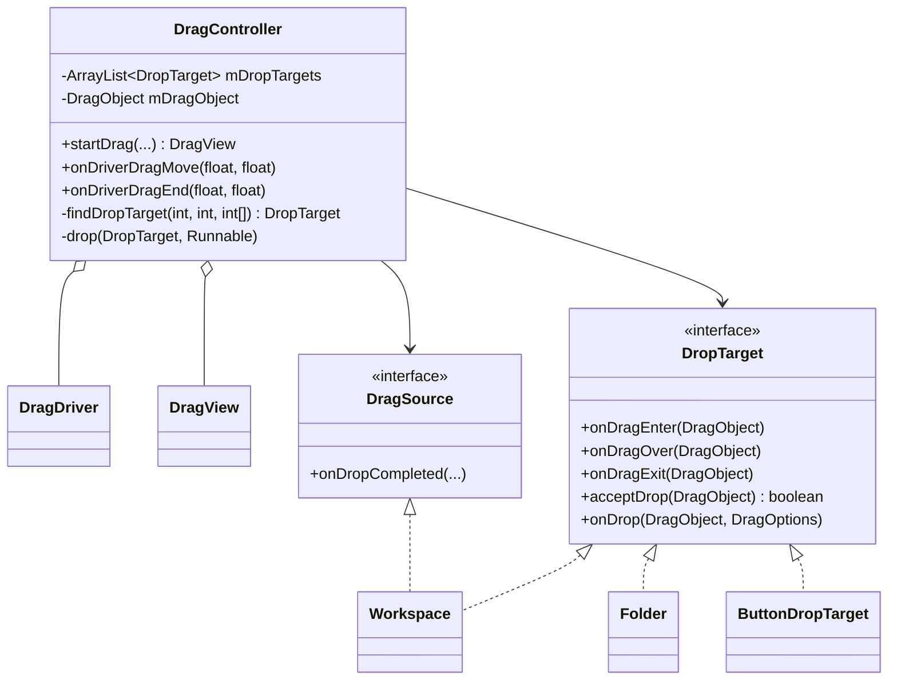

### 11.2 拖拽时序

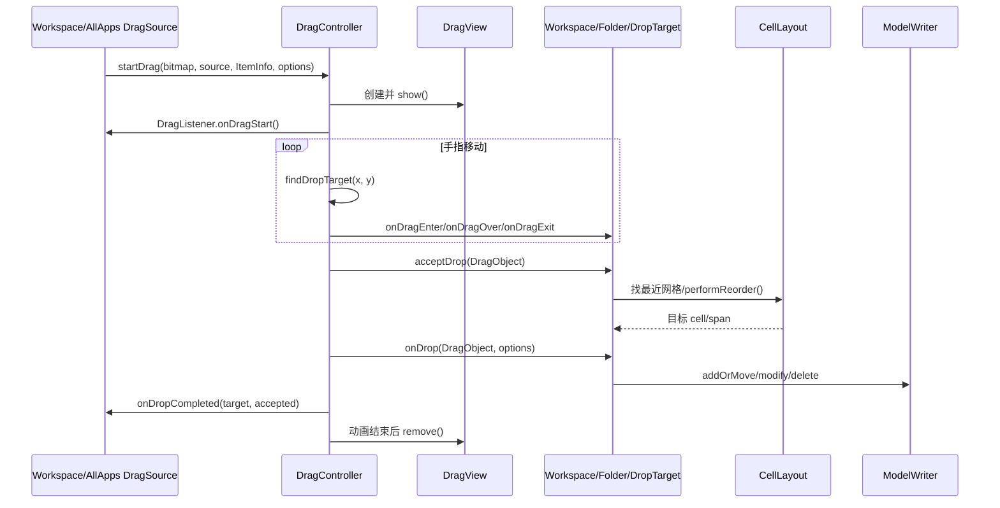

### 11.3 Workspace 放置决策

`Workspace.acceptDrop()` 和 `Workspace.onDrop()` 的主要判断顺序：

1. 确认当前状态允许放置。
2. 映射 DragLayer 坐标到目标 `CellLayout`。
3. 查找最近目标 cell。
4. 判断是否创建新文件夹。
5. 判断是否加入已有文件夹。
6. 调用 `CellLayout.performReorder()` 寻找空位或重排。
7. 外部拖入时创建新 View 和新数据库对象。
8. Workspace 内部移动时重挂 View、更新位置和 span。
9. 调用 `ModelWriter` 持久化。

`DragController.findDropTarget()` 按注册顺序逆序寻找命中目标；没有专门 DropTarget 接收时，最终回退给 `Workspace`。

## 十二、系统事件与增量更新

`LauncherModel` 同时实现 `LauncherAppsCompat.OnAppsChangedCallbackCompat`，处理：

- 包新增、删除、更新
- Package available/unavailable
- App suspended/unsuspended
- Managed Profile 状态变化
- Deep Shortcut 变化
- Locale 变化

典型链路：

```text
LauncherApps callback
    -> LauncherModel.onPackageAdded/Removed/Changed()
    -> enqueueModelUpdateTask(PackageUpdatedTask)
    -> launcher-loader 执行
    -> 更新 AllAppsList / IconCache / BgDataModel
    -> 主线程 Callbacks 增量更新 UI
```

原则上不应因为单个包变化就直接触发全量 `forceReload()`；优先使用对应的 `ModelUpdateTask` 保持增量更新。

## 十三、常见开发需求的源码入口

| 需求 | 首要入口 | 关联模块 |
|---|---|---|
| 修改桌面主布局层级 | `res/layout/launcher.xml`、`Launcher.setupViews()` | DragLayer、Workspace、Hotseat |
| 修改网格行列和图标尺寸 | `InvariantDeviceProfile`、`DeviceProfile`、`res/xml/device_profiles.xml` | CellLayout、Hotseat |
| 修改默认桌面图标 | `DefaultLayoutParser`、默认 workspace XML、`LauncherProvider.loadDefaultFavoritesIfNecessary()` | launcher.db 首次初始化 |
| 修改图标样式和标题 | `BubbleTextView`、`IconCache`、`IconProvider` | ShortcutInfo/AppInfo |
| 修改 All Apps | `AllAppsContainerView`、`AlphabeticalAppsList`、`AllAppsTransitionController` | LauncherState.ALL_APPS |
| 修改 Workspace 页面 | `Workspace`、`CellLayout`、`Launcher.bindScreens()` | workspaceScreens 表 |
| 修改拖拽和重排 | `DragController`、`Workspace.onDrop()`、`CellLayout.performReorder()` | ModelWriter |
| 修改文件夹 | `FolderIcon`、`Folder`、`FolderInfo` | FolderPagedView、ModelWriter |
| 修改 Widget 面板 | `WidgetsFullSheet`、`WidgetsModel`、`WidgetsRecyclerView` | WidgetPreviewLoader |
| 修改状态动画 | `LauncherState`、`LauncherStateManager`、各 `StateHandler` | UiFactory |
| 修改 Quickstep Overview | `quickstep/src/com/android/quickstep/`、Quickstep `UiFactory` | SystemUI shared jar |
| 修改数据库字段 | `LauncherSettings`、`LauncherProvider.DatabaseHelper` | schema 升级和迁移 |
| 处理应用安装卸载 | `LauncherModel`、`PackageUpdatedTask` | AllAppsList、IconCache |
| 处理旋转/尺寸变化 | `Launcher.onConfigurationChanged()`、`DeviceProfile` | reapplyUi/rebindModel |

## 十四、开发风险与约束

### 14.1 先确认产品变体

如果产品使用 `Launcher3QuickStep`，修改 `src_ui_overrides` 可能完全不生效；Quickstep 使用自己的同名覆盖类和资源。

建议先确认产品配置：

```bash
grep -R "Launcher3QuickStep\|Launcher3Go\|Launcher3" device/ vendor/ product/
```

### 14.2 区分 Model 对象与 View

`ItemInfo` 是数据对象，`BubbleTextView`、`FolderIcon`、Widget Host View 是 UI。两者通常通过 `View#setTag(ItemInfo)` 关联，但生命周期不同。

### 14.3 不要阻塞主线程或 Loader 线程

- 主线程阻塞会直接造成桌面无响应。
- `launcher-loader` 是串行线程，某个慢任务会阻塞包更新、数据库写入和后续加载。
- 网络、复杂图片处理或大批量 I/O 不应直接塞进现有模型队列。

### 14.4 数据库依赖 Java 层一致性

`favorites` 没有外键、唯一坐标约束和级联删除。修改 CRUD 时必须考虑：

- Folder 删除时清理子项。
- Screen 删除时处理其内容。
- Widget 删除时释放 AppWidget ID。
- Item 移动时同步 occupied grid、View、ItemInfo、BgDataModel 和数据库。

### 14.5 配置变化会重绑模型

`Launcher.onConfigurationChanged()` 在 orientation 或 screen size 变化时会：

```text
重新计算 DeviceProfile
    -> dispatchDeviceProfileChanged()
    -> reapplyUi()
    -> DragLayer.recreateControllers()
    -> rebindModel()
```

修改布局时必须测试旋转、多窗口、`wm size` 和不同 density，否则可能只在冷启动正常。

### 14.6 默认布局只在特定条件加载

修改默认 Workspace XML 不会自动覆盖已有用户数据库。测试默认布局需要使用新用户、清除 Launcher 数据，或明确执行数据库重建流程。

## 十五、调试与验证

### 15.1 常用命令

```bash
# 确认当前 HOME
adb shell cmd package resolve-activity -a android.intent.action.MAIN -c android.intent.category.HOME

# 查看 Launcher 进程
adb shell pidof com.android.launcher3

# 查看 Provider 与模型 dump
adb shell dumpsys activity provider com.android.launcher3

# 查看包日志
adb logcat -s Launcher Launcher.Model LauncherProvider LoaderTask

# 查看数据库文件，通常需要 userdebug/eng 和相应权限
adb shell run-as com.android.launcher3 ls databases
```

仓库还提供：

- `print_db.py`：辅助查看 Launcher 数据库
- `fill_screens.py`：辅助填充 Workspace 测试数据

### 15.2 推荐日志点

| 问题 | 建议日志点 |
|---|---|
| 启动白屏/图标晚出现 | `Launcher.onCreate()`、`LauncherModel.startLoader()`、`LoaderTask.run()`、`LoaderResults.bindWorkspace()` |
| 图标重启后位置恢复 | `Workspace.onDrop()`、`ModelWriter.moveItemInDatabase()`、Provider update |
| 图标重复或丢失 | `LoaderCursor.checkItemPlacement()`、`BgDataModel.addItem()`、Favorites 数据 |
| 安装后 All Apps 不更新 | `LauncherModel.onPackageAdded()`、`PackageUpdatedTask`、`AllAppsList.addPackage()` |
| 状态动画异常 | `LauncherStateManager.goToState()`、具体 `StateHandler` |
| 拖拽无法放置 | `DragController.findDropTarget()`、`Workspace.acceptDrop()`、`CellLayout.performReorder()` |
| 旋转后布局错乱 | `Launcher.onConfigurationChanged()`、`DeviceProfile`、`rebindModel()` |

### 15.3 最小修改验证矩阵

任何影响 Launcher 核心 UI 或数据的修改，至少验证：

1. 冷启动与热启动。
2. Home 键重复进入。
3. 横竖屏或目标产品支持的方向变化。
4. `wm size`、density 或多窗口变化。
5. Workspace 图标新增、移动、删除和重启持久化。
6. Folder 新建、加入、移出和删除。
7. Widget 添加、配置、缩放和删除。
8. App 安装、更新、卸载和禁用。
9. All Apps 与 Workspace 状态切换。
10. Quickstep 产品上的 Overview、返回键和手势导航。

## 十六、源码索引

| 主题 | 文件与关键位置 |
|---|---|
| 构建变体 | `Android.mk:32-238` |
| HOME Activity | `AndroidManifest.xml:68-87` |
| Provider 入口 | `LauncherProvider.java:108-119` |
| Launcher 初始化 | `Launcher.java:255-350` |
| View 装配 | `Launcher.java:910-946` |
| AppState 初始化 | `LauncherAppState.java:55-152` |
| Model 线程与回调 | `LauncherModel.java:82-178`、`:308-313` |
| Loader 分支 | `LauncherModel.java:442-493` |
| Loader 四阶段 | `model/LoaderTask.java:157-227` |
| Workspace 绑定 | `model/LoaderResults.java:80-207` |
| 内存模型 | `model/BgDataModel.java:57-124` |
| All Apps 模型 | `AllAppsList.java:42-218` |
| UI 根布局 | `res/layout/launcher.xml:15-75` |
| Workspace | `Workspace.java:101-282` |
| Workspace Drop | `Workspace.java:1609-1929` |
| 网格占用 | `CellLayout.java:73-209` |
| 拖拽分发 | `dragndrop/DragController.java:139-225`、`:464-638` |
| 状态定义 | `LauncherState.java:75-174` |
| 状态切换 | `LauncherStateManager.java:201-403` |
| 普通 UiFactory | `src_ui_overrides/.../UiFactory.java:29-65` |
| Quickstep UiFactory | `quickstep/src/.../UiFactory.java:59-180` |
| Favorites schema | `LauncherSettings.java:114-284` |
| Provider schema version | `LauncherProvider.java:80-85` |
| ModelWriter CRUD | `model/ModelWriter.java:89-289` |
| ItemInfo 基类 | `ItemInfo.java:30-180` |

## 十七、个人理解

Android 9 Launcher3 最适合用“模型驱动 UI，加状态机和拖拽协调层”来理解：

```text
系统应用与数据库
    -> LauncherModel 在后台线程维护模型
    -> LoaderResults/Callbacks 在主线程绑定 View
    -> LauncherStateManager 决定当前 UI 形态
    -> DragController 协调交互
    -> ModelWriter 把交互结果写回数据库和内存模型
```

定位问题时，不要只在 `Launcher.java` 中搜索。应先判断问题属于哪条轴线：

- 启动和生命周期：`LauncherProvider -> LauncherAppState -> Launcher`
- 数据加载：`LauncherModel -> LoaderTask -> LoaderResults`
- UI 布局：`LauncherRootView -> DragLayer -> Workspace/AllApps/Hotseat`
- 状态动画：`LauncherStateManager -> StateHandler`
- 拖拽：`DragController -> DropTarget -> Workspace/CellLayout`
- 持久化：`ModelWriter -> LauncherProvider -> launcher.db`

建立这六条主链后，大多数 Launcher 定制需求都可以快速缩小到少数几个类，而不是在三百多个 Java 文件中盲目搜索。
